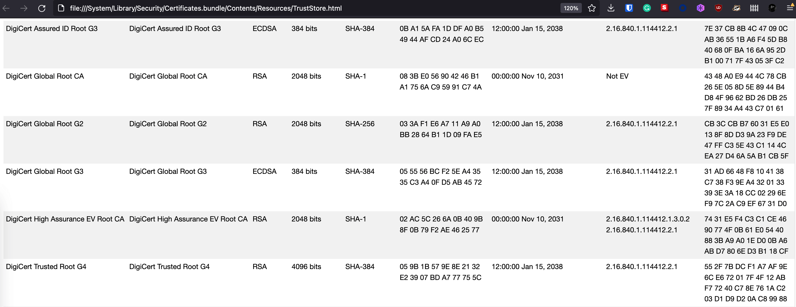

Checking SSL certificates on a browser is easy. Just click the green lock icon and you're good to go. But what if
doing the same in a more hacker way? This is where `openssl` comes into play.

Let's start by checking the SSL certificate of this website:

```sh
openssl s_client -connect www.serhatdundar.com:443
```

```
depth=2 C = US, O = DigiCert Inc, OU = www.digicert.com, CN = DigiCert High Assurance EV Root CA
depth=1 C = US, O = DigiCert Inc, OU = www.digicert.com, CN = DigiCert SHA2 High Assurance Server CA
depth=0 C = US, ST = California, L = San Francisco, O = "GitHub, Inc.", CN = www.github.com
---
Certificate chain
 0 s:/C=US/ST=California/L=San Francisco/O=GitHub, Inc./CN=www.github.com
   i:/C=US/O=DigiCert Inc/OU=www.digicert.com/CN=DigiCert SHA2 High Assurance Server CA
 1 s:/C=US/O=DigiCert Inc/OU=www.digicert.com/CN=DigiCert SHA2 High Assurance Server CA
   i:/C=US/O=DigiCert Inc/OU=www.digicert.com/CN=DigiCert High Assurance EV Root CA
---
Server certificate
-----BEGIN CERTIFICATE-----
MIIHMDCCBhigAwIBAgIQAkk+B/qeN1otu8YdlEMPzzANBgkqhkiG9w0BAQsFADBw
MQswCQYDVQQGEwJVUzEVMBMGA1UEChMMRGlnaUNlcnQgSW5jMRkwFwYDVQQLExB3
d3cuZGlnaWNlcnQuY29tMS8wLQYDVQQDEyZEaWdpQ2VydCBTSEEyIEhpZ2ggQXNz
dXJhbmNlIFNlcnZlciBDQTAeFw0yMDA1MDYwMDAwMDBaFw0yMjA0MTQxMjAwMDBa
MGoxCzAJBgNVBAYTAlVTMRMwEQYDVQQIEwpDYWxpZm9ybmlhMRYwFAYDVQQHEw1T
YW4gRnJhbmNpc2NvMRUwEwYDVQQKEwxHaXRIdWIsIEluYy4xFzAVBgNVBAMTDnd3
dy5naXRodWIuY29tMIIBIjANBgkqhkiG9w0BAQEFAAOCAQ8AMIIBCgKCAQEAsj49
...
-----END CERTIFICATE-----
subject=/C=US/ST=California/L=San Francisco/O=GitHub, Inc./CN=www.github.com
issuer=/C=US/O=DigiCert Inc/OU=www.digicert.com/CN=DigiCert SHA2 High Assurance Server CA
---
No client certificate CA names sent
Server Temp Key: ECDH, X25519, 253 bits
---
SSL handshake has read 3673 bytes and written 289 bytes
---
New, TLSv1/SSLv3, Cipher is ECDHE-RSA-AES128-GCM-SHA256
Server public key is 2048 bit
Secure Renegotiation IS supported
Compression: NONE
Expansion: NONE
No ALPN negotiated
SSL-Session:
    Protocol  : TLSv1.2
    Cipher    : ECDHE-RSA-AES128-GCM-SHA256
    Session-ID: XXXXXXXXXXXXXXXXXXXXXXXXXXXXXXXXXXXXXXXXXXXXXXXXXXXXXXXXXXXXXXX
    Session-ID-ctx:
    Master-Key: XXXXXXXXXXXXXXXXXXXXXXXXXXXXXXXXXXXXXXXXXXXXXXXXXXXXXXXXXXXXXXXXXXXXXXXXXXXXXXXXXXXXXX
    TLS session ticket lifetime hint: 7200 (seconds)
    TLS session ticket:
    0000 - xx xx 60 d0 86 88 c0 26-2e 67 c0 e0 01 84 09 ab   .,`....&.x......
    0010 - xx xx 95 f2 fa fa 1f f6-01 06 e3 99 23 2d 69 9a   i...........#-x.
    0020 - xx xx d1 f6 98 35 b5 f4-8f 91 47 b1 8e a6 d4 d2   *....6....G.....
    0030 - xx xx b2 f4 61 f1 b0 7d-43 cb 66 62 c6 15 52 ad   \*..x..}C.fb..R.
    0040 - xx xx c3 f9 a9 f3 f8 e7-f2 7f b8 d3 0e 02 d2 da   /...x...........
    0050 - xx xx 0f 8f c1 1c 6e b3-f0 ae 4c ac 4e f6 8d 7c   g.....x...L.N..|
    0060 - xx xx 3b 2a 77 b3 c2 f0-2b e3 9f 73 1e db 07 6c   /.;*x...+..s...l
    0070 - xx xx a3 b5 42 74 de 4b-55 73 15 cf b0 97 c7 84   <...Bx.KUs......
    0080 - xx xx 65 ee cc 68 35 68-76 ef 7b 4a 7b 41 b3 94   ..e..x5hv.{J{A..
    0090 - xx xx 57 3f 74 a8 e8 0a-ec de 8b 77 49 f9 33 b0   `0W?x......wI.3.

    Start Time: 1643082971
    Timeout   : 7200 (sec)
    Verify return code: 0 (ok)
```

Let's investigate this response piece by piece.

### Certificate Attributes

```
depth=2 C = US, O = DigiCert Inc, OU = www.digicert.com, CN = DigiCert High Assurance EV Root CA
depth=1 C = US, O = DigiCert Inc, OU = www.digicert.com, CN = DigiCert SHA2 High Assurance Server CA
depth=0 C = US, ST = California, L = San Francisco, O = "GitHub, Inc.", CN = www.github.com
```

As you can see above, a certificate consists of several fields. Here is what they mean:

```
CN: CommonName
OU: OrganizationalUnit
O: Organization
L: Locality
S: StateOrProvinceName
C: CountryName
```

`depth` levels reflect the certificate chain, or in other words, the _chain of trust_:

```
==> 0. OU = www.digicert.com, CN = DigiCert High Assurance EV Root CA
    ==> 1. OU = www.digicert.com, CN = DigiCert SHA2 High Assurance Server CA
        ==> 2. O = "GitHub, Inc.", CN = www.github.com
```

This leveling means:

- We trust the certificate issued by _Github_ because we trust _Digicert SHA2 Assurance Server_.
- We trust the certificate issued by _Digicert SHA2 Assurance Server_ because we trust
  _DigiCert High Assurance EV Root CA_.

But how do we trust _DigiCert High Assurance EV Root CA_?

If you recall from the _"Chain of Trust"_, we need to trust someone at the top somehow. Therefore our operating systems
and our browsers trust some root CAs, and their _**self-signed**_ certificates by default.

On an OSx system you can find the list of trusted and blocked certificate issuers by choosing _"Go > Go to Folder"_ in
the Finder, and then pasting `/System/Library/Security/Certificates.bundle/Contents/Resources/TrustStore.html` there.

[](assets/trust-store.png)

### Certificate Chain

```
Certificate chain
 0 s:/C=US/ST=California/L=San Francisco/O=GitHub, Inc./CN=www.github.com
   i:/C=US/O=DigiCert Inc/OU=www.digicert.com/CN=DigiCert SHA2 High Assurance Server CA
 1 s:/C=US/O=DigiCert Inc/OU=www.digicert.com/CN=DigiCert SHA2 High Assurance Server CA
   i:/C=US/O=DigiCert Inc/OU=www.digicert.com/CN=DigiCert High Assurance EV Root CA
```

This section is pretty similar to the previous one, it lists the whole chain. As can be seen above, there are two
certificates in the chain. Certificate number 0 is the first one we check for validity, and then we continue with
certificate 1. By the way, `s` stands for `subject`, and `i` stands for `issuer` in this representation.

This certificate chain can be summarized as follows:

- _DigiCert High Assurance EV Root CA_ issued a certificate for _DigiCert SHA2 High Assurance Server CA_.
- _DigiCert SHA2 High Assurance Server CA_ issued a certificate for _GitHub_

### SSL Session

This section includes details about the SSL/TLS handshake we've just completed.

```
New, TLSv1/SSLv3, Cipher is ECDHE-RSA-AES128-GCM-SHA256

SSL-Session:
    Protocol  : TLSv1.2
    Cipher    : ECDHE-RSA-AES128-GCM-SHA256
    Session-ID: XXXXXXXXXXXXXXXXXXXXXXXXXXXXXXXXXXXXXXXXXXXXXXXXXXXXXXXXXXXXXXX
    Session-ID-ctx:
    Master-Key: XXXXXXXXXXXXXXXXXXXXXXXXXXXXXXXXXXXXXXXXXXXXXXXXXXXXXXXXXXXXXXXXXXXXXXXXXXXXXXXXXXXXXX
    TLS session ticket lifetime hint: 7200 (seconds)
    TLS session ticket:
    0000 - xx xx 60 d0 86 88 c0 26-2e 67 c0 e0 01 84 09 ab   .,`....&.x......
    0010 - xx xx 95 f2 fa fa 1f f6-01 06 e3 99 23 2d 69 9a   i...........#-x.
    0020 - xx xx d1 f6 98 35 b5 f4-8f 91 47 b1 8e a6 d4 d2   *....6....G.....
    0030 - xx xx b2 f4 61 f1 b0 7d-43 cb 66 62 c6 15 52 ad   \*..x..}C.fb..R.
    0040 - xx xx c3 f9 a9 f3 f8 e7-f2 7f b8 d3 0e 02 d2 da   /...x...........
    0050 - xx xx 0f 8f c1 1c 6e b3-f0 ae 4c ac 4e f6 8d 7c   g.....x...L.N..|
    0060 - xx xx 3b 2a 77 b3 c2 f0-2b e3 9f 73 1e db 07 6c   /.;*x...+..s...l
    0070 - xx xx a3 b5 42 74 de 4b-55 73 15 cf b0 97 c7 84   <...Bx.KUs......
    0080 - xx xx 65 ee cc 68 35 68-76 ef 7b 4a 7b 41 b3 94   ..e..x5hv.{J{A..
    0090 - xx xx 57 3f 74 a8 e8 0a-ec de 8b 77 49 f9 33 b0   `0W?x......wI.3.

    Start Time: 1643082971
    Timeout   : 7200 (sec)
    Verify return code: 0 (ok)
```

Here we see two different TLS versions, `TLSv1` and `TLSv1.2`, which might be confusing. The first one (`TLSv1/SSLv3`)
describes the minimum protocol requirement with the negotiated cipher suite, while the second one (`TLSv1.2`) describes
the actual protocol version is currently being negotiated. 

- `Protocol`: The handshake has been completed by using the TLSv1.2 protocol.
- `Cipher`: `ECDHE-RSA-AES128-GCM-SHA256` cipher is used during the handshake.
- `Start Time`: The handshake started on 1643082971 (UNIX timestamp).
- `Timeout`: It's valid for 7200 seconds (2 hours). After we will need to do another SSL/TLS handshake.
- `Session-ID`: The unique session ID created for this SSL/TLS handshake. Will expire after 2 hours. Having a session ID
  here also means that the server keeps track of state and if a client reconnects with a session ID the server has
  given out, it can reuse the existing state it tracked there.
- `TLS session ticket`: [SSL Session tickets](https://tools.ietf.org/search/rfc5077) provide a mechanism that means we
  don't have to keep the same state at the server.

### SSL Certificate

What you see here is the SSL Certificate of this website in X.509 format:

```
-----BEGIN CERTIFICATE-----
MIIHMDCCBhigAwIBAgIQAkk+B/qeN1otu8YdlEMPzzANBgkqhkiG9w0BAQsFADBw
MQswCQYDVQQGEwJVUzEVMBMGA1UEChMMRGlnaUNlcnQgSW5jMRkwFwYDVQQLExB3
d3cuZGlnaWNlcnQuY29tMS8wLQYDVQQDEyZEaWdpQ2VydCBTSEEyIEhpZ2ggQXNz
dXJhbmNlIFNlcnZlciBDQTAeFw0yMDA1MDYwMDAwMDBaFw0yMjA0MTQxMjAwMDBa
MGoxCzAJBgNVBAYTAlVTMRMwEQYDVQQIEwpDYWxpZm9ybmlhMRYwFAYDVQQHEw1T
YW4gRnJhbmNpc2NvMRUwEwYDVQQKEwxHaXRIdWIsIEluYy4xFzAVBgNVBAMTDnd3
dy5naXRodWIuY29tMIIBIjANBgkqhkiG9w0BAQEFAAOCAQ8AMIIBCgKCAQEAsj49
6jJ99veEXO7WdxGQZ7idtCnDcjZqQeDiy6057SwXj9yDUVnqhwo/yII8+y6Jpk3g
75LpPpYNjiOwYp/JkpWbpBAd1FWlvXJo/eZS+TwuIYb7JSc2H3NDDKt2VV5SSKQd
XOkDNqq7BisOFp2/TYwCMZboLufwRR5fKxL0nTKIOCwpnH8k//UdWpvTgIixDGLY
QCwHt0fYEo49jFeDaKD4WMBPq6Tx1iKWBhw3HVc/OyvI3yjRAx4Anf/DCSt9YTW6
...
-----END CERTIFICATE-----
```

If you want to see other certificates in the chain, for example, the certificate of
_"OU = www.digicert.com, CN = DigiCert SHA2 High Assurance Server CA"_, then you need to run:

```sh
openssl s_client -connect www.serhatdundar.com:443 -showcerts
```

You can simply save this certificate to a file named `xyz.pem` and then parse for the details:

```sh
openssl x509 -in xyz.pem -text
```

```
Certificate:
  Data:
    Version: 3 (0x2)
    Serial Number:
      02:49:3e:07:fa:9e:37:5a:2d:bb:c6:1d:94:43:0f:cf
  Signature Algorithm: sha256WithRSAEncryption
    Issuer: C=US, O=DigiCert Inc, OU=www.digicert.com, CN=DigiCert SHA2 High Assurance Server CA
    Validity
      Not Before: May  6 00:00:00 2020 GMT
      Not After : Apr 14 12:00:00 2022 GMT
    Subject: C=US, ST=California, L=San Francisco, O=GitHub, Inc., CN=www.github.com
    Subject Public Key Info:
      Public Key Algorithm: rsaEncryption
        Public-Key: (2048 bit)
        Exponent: 65537 (0x10001)
        .....
    X509v3 Subject Alternative Name:
        DNS:www.github.com, DNS:*.github.com, DNS:github.com, DNS:*.github.io, DNS:github.io, DNS:*.githubusercontent.com, DNS:githubusercontent.com
    ...

    X509v3 Certificate Policies:
        Policy: 2.16.840.1.114412.1.1
          CPS: https://www.digicert.com/CPS
        Policy: 2.23.140.1.2.2

    Authority Information Access:
        OCSP - URI:http://ocsp.digicert.com
        CA Issuers - URI:http://cacerts.digicert.com/DigiCertSHA2HighAssuranceServerCA.crt
```

After parsing the certificate, you can see many details about it, such as the signature algorithm (sha256WithRSAEncryption),
issuer, validity, subject (owner of the certificate), the public key of the subject, and so on. _Subject Alternative Name_
represents all domains that this certificate is valid for.

### Protocol and Cipher Testing

If you want to check if a server supports a specific protocol, you can run:

```sh
# possible protocol versions: -ssl2, -ssl3, -tls1, -tls1_1, -tls1_2, or tls1_3
openssl s_client -connect www.serhatdundar.com:443 -PROTOCOL_VERSION
```

If you get an `unknown option` error while running this command, it means that the `openssl` version you are using
has deprecated this protocol version already. If it's not deprecated by your `openssl` version, but also not supported
by the server, you should get an `ssl handshake failure` error.

Similarly, you can test a server to see if it's accepting a specific cipher:

```sh
openssl s_client -connect www.serhatdundar.com:443 -cipher CIPHER-STRING
```

You can access possible cipher strings as follows:

```sh
# all OpenSSL ciphers including NULL ciphers
openssl ciphers -v 'ALL:eNULL'

# all ciphers except NULL and anonymous DH then sort by strength
openssl ciphers -v 'ALL:!ADH:@STRENGTH'

# all ciphers except ones with no encryption (eNULL) or no authentication (aNULL)
openssl ciphers -v 'ALL:!aNULL'
```

For more details, you can refer to [OpenSSL](https://www.openssl.org/docs/man1.1.1/man1/ciphers.html) manuals.

Cheers.