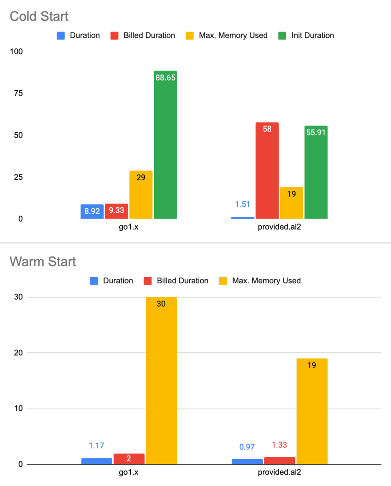

## Introduction

AL2 runtimes and migrating from AL1 to AL2 for NodeJS, Python, Ruby, and .NET are pretty straightforward. The only
exception is Go. Things are a bit cumbersome there as a custom runtime named `provided.al2` comes into play.

By the time of this writing, the following runtimes are
[provided](https://docs.aws.amazon.com/lambda/latest/dg/lambda-runtimes.html) by AWS:

| Name               | Identifier    | Operating system | Architectures |
|--------------------|---------------|------------------|---------------|
| Node.js 18         | nodejs18.x    | Amazon Linux 2   | x86_64, arm64 |
| Node.js 16         | nodejs16.x    | Amazon Linux 2   | x86_64, arm64 |
| Node.js 14         | nodejs14.x    | Amazon Linux 2   | x86_64, arm64 |
| Node.js 12         | nodejs12.x    | Amazon Linux 2   | x86_64, arm64 |
| Python 3.9         | python3.9     | Amazon Linux 2   | x86_64, arm64 |
| Python 3.8         | python3.8     | Amazon Linux 2   | x86_64, arm64 |
| **Python 3.7**     | **python3.7** | **Amazon Linux** | **x86_64**    |
| Java 11            | java11        | Amazon Linux 2   | x86_64, arm64 |
| Java 8             | java8.al2     | Amazon Linux 2   | x86_64, arm64 |
| **Java 8**         | **java8**     | **Amazon Linux** | **x86_64**    |
| .NET Core 3.1      | dotnetcore3.1 | Amazon Linux 2   | x86_64, arm64 |
| .NET 6             | dotnet6       | Amazon Linux 2   | x86_64, arm64 |
| .NET 5             | dotnet5.0     | Amazon Linux 2   | x86_64        |
| **Go 1.x**         | **go1.x**     | **Amazon Linux** | **x86_64**    |
| Ruby 2.7           | ruby2.7       | Amazon Linux 2   | x86_64, arm64 |
| Custom Runtime     | provided.al2  | Amazon Linux 2   | x86_64, arm64 |
| Custom Runtime     | provided      | Amazon Linux     | x86_64        |

As can be seen above, the `go1.x` runtime is still on AL1 instead of AL2. One of the major differences between AL1 and
AL2 is supported architectures. AL2 comes with `arm64` support. To benefit from `arm64` support, and to migrate to a
more performance/cost-efficient AL2, `provided.al2` is the only option for Go lambda functions.

## Setup

Without further ado, let’s continue with a brief comparison of these two runtimes and some performance metrics. Here is
the lambda that I will be using for testing purposes:

```go
package main

import (
  "context"
  "encoding/json"
  "log"

  "github.com/aws/aws-lambda-go/events"
  "github.com/aws/aws-lambda-go/lambda"
  "github.com/aws/aws-lambda-go/lambdacontext"
)

type LambdaDebug struct {
  Context lambdacontext.LambdaContext
  Request events.APIGatewayProxyRequest
}

func HandleRequest(ctx context.Context, request events.APIGatewayProxyRequest) (events.APIGatewayProxyResponse, error) {
  lc, _ := lambdacontext.FromContext(ctx)

  resp := &LambdaDebug{
    Context: *lc,
    Request: request,
  }

  data, _ := json.Marshal(resp)

  log.Printf("Request data %s", string(data))
  return events.APIGatewayProxyResponse{Body: string(data), StatusCode: 200}, nil
}

func main() {
  lambda.Start(HandleRequest)
}
```

Compilation steps differ a bit depending on the selected architecture. Note the `GOARCH` section:


- x86_64 (AL1): `GOOS=linux GOARCH=amd64 go build -o sample-lambda ./...`
- arm64 (AL2): `GOOS=linux GOARCH=arm64 go build -o bootstrap ./...`

---------------------

Terraform configuration for the IAM role:

```terraform
resource "aws_iam_role" "sample-hello-lambda" {
  name               = "sample-hello-lambda"
  assume_role_policy = <<POLICY
{
  "Version": "2012-10-17",
  "Statement": {
    "Action": "sts:AssumeRole",
    "Principal": {
      "Service": "lambda.amazonaws.com"
    },
    "Effect": "Allow"
  }
}
POLICY
}
```

Terraform configuration for `go1.x` on `x86_64 (AL1)`:

```terraform
locals {
  go_lambda_skeleton_amd64_dir = "lambdas/go-lambda-skeleton-amd64.zip"
}

resource "aws_lambda_function" "sample-lambda-amd64" {
  function_name    = "sample-lambda-amd64"
  architectures    = ["x86_64"]
  filename         = local.go_lambda_skeleton_amd64_dir
  runtime          = "go1.x"
  handler          = "go-lambda-skeleton-amd64"
  source_code_hash = filebase64sha256(local.go_lambda_skeleton_amd64_dir)
  role             = aws_iam_role.sample-hello-lambda.arn
}
```
Terraform configuration for `provided.al2` on `arm64 (AL2)`:

```terraform
locals {
  go_lambda_skeleton_arm64_dir = "lambdas/go-lambda-skeleton-arm64.zip"
}

resource "aws_lambda_function" "sample-lambda-arm64" {
  function_name    = "sample-lambda-arm64"
  architectures    = ["arm64"]
  filename         = local.go_lambda_skeleton_arm64_dir
  runtime          = "provided.al2"
  handler          = "bootstrap"
  source_code_hash = filebase64sha256(local.go_lambda_skeleton_arm64_dir)
  role             = aws_iam_role.sample-hello-lambda.arn
}
```

The most notable differences are `architectures`, `runtime` and `handler` between two configurations.

I will be using a very simple event for testing purposes when triggering the lambda:

```json
{
  "foo": "bar"
}
```

## Performance

There are some notable differences between `go1.x` and `provided.al2` runtimes, but before going into details, here
is a brief overview of some metrics obtained from 10K requests:

| Start | Avg. Duration | Avg. Billed Duration | Avg. Max. Memory Used | Avg. Init Duration | Runtime      |
|-------|---------------|----------------------|-----------------------|--------------------|--------------|
| Cold  | 8.92 ms.      | 9.33 ms.             | 29 mb.                | 88.65 ms.          | go1.x        |
| Cold  | 1.51 ms.      | 58.1 ms.             | 19 mb.                | 55.91 ms.          | provided.al2 |
| Warm  | 1.17 ms.      | 2.1 ms.              | 30 mb.                | N/A                | go1.x        |
| Warm  | 0.97 ms.      | 1.33 ms.             | 19 mb.                | N/A                | provided.al2 |

[](assets/lambda-cold-warm-start.png)


As can be seen above:

- `provided.al2` consumes less memory both in cold (52.63%) and warm (57.89%) start.
- `provided.al2` performs better in cold start (58.55%).
- `provided.al2` includes the init duration to the billing, while `go1.x` doesn't. As a result, the billed duration of
  `provided.al2` is more than `go1.x` (521%) in cold start.
- `provided.al2` is a clear winner in all categories during warm start.

At first glance, `provided.al2` seems like a better option if cold starts are not very often. On the pricing side,
by the time of this writing, x86 costs $0.0000000021 per 1ms, and arm64 costs $0.0000000017 per 1ms. when 128mb memory
is allocated. So overall, `arm64` is 19% cheaper than `x86`.

## Conclusion

Pricing between two runtimes depends on cold-warm start patterns for sure. However, if cold start isn't something you
deal with very often, `provided.al2` is an easy choice. First of all, it's memory efficient. Second, it's faster in
cold starts. `provided.al2` is also the winner in _duration_ and _memory usage_ in warm starts. Finally, the price per
1ms and the price for every GB-second favor `provided.al2` more than `go1.x`.
