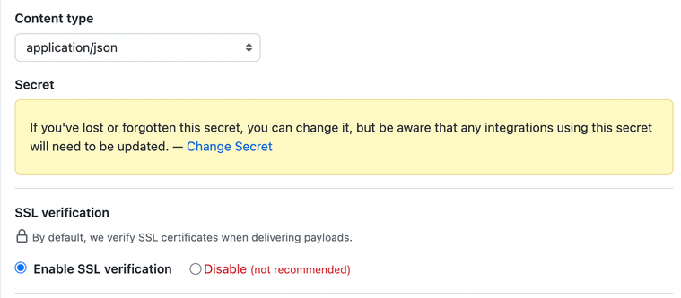

My team at [Cobalt](https://www.cobalt.io) recently released _webhooks_ as part of our integration offerings.
Therefore, I had to update my knowledge on the topic, especially on the security part.

In this article, I will focus on the rationale behind some popular webhook security methods and will try to explain
them in simple terms.

## 1. Basics Risks and Measures

### 1.1. Webhooks can be set to leak data silently

Let’s assume you are a webhook provider and an attacker compromises the credentials of one of your clients. If your
platform doesn’t notify users when a webhook is created or updated - the attacker can create a webhook silently and
start leaking data without alerting anyone. This silent tunnel will let the attacker stay in the system longer
undetected. Therefore:

- Send an e-mail or any other similar notification to your customers when a webhook is created or updated.
- Require re-authentication before a webhook is created or updated.

### 1.2. Data on transport is in danger

Data on transport is a commonly known security risk, especially if the traffic isn't encrypted. Therefore:

- Only send data to endpoint URLs that employ `https://` scheme
- Validate SSL certificates
  - Do not allow self-signed certificates
  - Only allow secure TLS versions (TLS 1.2+ by the time of this writing)

## 2. Authenticity Risks

### 1. Client may not be controlling the webhook handler

Multiple scenarios can fall into this category. For example:

- The client might not be the owner of the webhook handler anymore
- The client might be using a handler that belongs to someone else by mistake or as a result of a breach

Nowadays there are many online services that your customers can quickly set up to receive webhooks. Even though these
services are great for testing webhooks and consuming them - they also bring some risks. For example, a customer may
set up a webhook handler by using one of these services and obtain a URL quickly. Over time, if someone else manages
to obtain the same URL, either by chance or as a result of a breach - they can start receiving data of your customers.

Secondly, do not expect every customer to be experienced with webhooks or be a tech guru. Therefore, steps asking
_"are you aware of what you are doing"_ is a wise measure to prevent unexpected results.

But how? One of the common ways is implementing a verification challenge. There are two types of them.

- One-time verification challenges
- Periodical verification challenges

When using the first method, the client is expected to perform some type of verification only the first time
when they set up a webhook. The second approach forces them to do some type of verification regularly.

The verification can be implemented in any form as long as they ensure that the client has full access to the webhook
and can change its behavior.

But the most common way is sending a randomized string to the consumer either in an HTTP header or as a query string
parameter, and expecting them to send it back. This method typically uses HTTP GET as no request body is needed. This
method can be hardened with additional expectations, such as time-boxing the response.

For example,
[Twitter](https://developer.twitter.com/en/docs/twitter-api/enterprise/account-activity-api/guides/securing-webhooks)
expects this verification to happen within 3 seconds and does periodical verification challenges every 24 hours.
[Zoom](https://developer.twitter.com/en/docs/twitter-api/enterprise/account-activity-api/guides/securing-webhooks) also
does the same, expect the verification to be completed within 3 seconds, and re-verification to happen every 72 hours.

### 2. Client may process fraudulent webhook events

The web service of a client accepting POST requests from the webhook provider may process fraudulent webhook events if
measures to ensure authenticity aren’t taken.

One way to prevent this is to implement a way to share secrets between applications. It’s typical for clients to
generate a random string that only they know, and share this secret with the webhook provider. By doing so, the
provider will be able to send the shared secret back to the client whenever they are sending a webhook, and the client
will be able to verify the authenticity of the requests with this token.

Secret sharing should be a one-time thing and the client shouldn’t be able to view the same secret again. The client
and the provider are expected to store this secret safely, so it should never be displayed in plain text after the
initial exchange. GitHub example:

Even though this method seems like a good idea at first glance, anyone who can obtain this secret token can still trick
the client easily, since the secret will constantly be on transport.

Another commonly adopted method is providing clients with a set of IP addresses where requests can come from. Clients
are then expected to whitelist these IP addresses and blacklist everything else.

These two methods can be used for authenticity, however, they don’t guarantee the integrity of the message.

## 3. Integrity Risks

### 3.1. Client may receive tampered events

There are two issues with the "shared-secret" method:

- The shared secret is always in transit mode and constantly exchanged between the webhook provider and consumer
- It doesn’t guarantee message integrity. Even if the message sender isn’t fraudulent, there is no guarantee of the
  integrity of the message, and the message may have been tampered with on the way.

Symmetric and asymmetric encryption methods can be used to ensure payload integrity. If you need a refresher on these
concepts, visit my
[symmetric VS asymmetric encryption](https://www.serhatdundar.com/posts/symmetric-and-asymmetric-encryption/) post on
the topic.

One of the most common symmetric encryption approaches to ensure webhook integrity is the
_Hash-based Message Authentication Code (HMAC)_. This method is pretty straightforward:

- Webhook provider and the consumer shares a secret once, at the beginning.
- The provider signs their message by using the previously exchanged secret + a hashing algorithm.
- The provider sends the message as usual, but this time also appends the signature.
- The consumer signs the received message with the shared secret and then compares signatures. If the message has been
  tampered with, signatures won’t match.

The challenge here is to find a way to share secrets securely over the wire. To deal with this challenge, one can also
use asymmetric encryption methods and exchange their public key with consumers, instead of their private. In this
scenario:

- The provider signs their message by using their secret key.
- The provider shares their public key with consumers.
  - How? It doesn't matter. They may choose to publish it publicly, send it together with their request, make it only
    accessible to webhook consumers on a more secure platform, and so on. The possibilities are endless.
- The provider sends the message together with the signature.
- The consumer signs the received message with the public key they obtained and then compares signatures.

The same logic, but this time a key isn't shared between parties, so no need to worry about a key exchange.

### 3.2. Events may be obtained by an unauthorized party

There is a high chance for your events to be obtained by an unauthorized party. This may sound pessimistic, but
actually, a common security measure that forces you to think about what to do when it happens.

“Skinny payloads”, “dataless notifications”, etc. there are many names for this approach. But essentially, it’s about
sending the minimum data you can with webhooks. Some applications use this approach to notify their users about
something, but details of that thing can only be revelated from a different resource that they protect better, such as
a web application or an API.

Pros? The attacker can’t do anything with the data they steal. Cons? Additional overhead for the consumer as they will
have to log in to an application, or make an API call to service, to be able to learn details of the notification.

## 4. What's all this fuss about?

In a scenario where clients pull data from your API, the security expectations from a client are minimum. They just
need to keep their API token safe, and that’s pretty much it. However, in a push model service communication, such as
webhooks, the responsibilities of a client are bigger.

First of all, they need to make sure that the source pushing them the data is the one they are expecting, not an
intruder (authenticity). Since a webhook is nothing but a web service that accepts HTTPS POST requests from a source,
clients also undertake the responsibility of keeping their web services safe. Clients also need to make sure that the
message hasn’t been tampered, with by implementing integrity checks on their end. Webhook providers not only take
security measures for themselves but also add additional measures to enforce their clients to take necessary actions.

## Resources

- [webhooks.fyi](https://webhooks.fyi/): A comprehensive webhook security resource from Ngrok
- [hookdeck.com](https://hookdeck.com/webhooks/guides/complete-guide-to-webhook-security#webhook-security-concerns): A very detailed resource, not only about webhook security, but also webhooks in general
